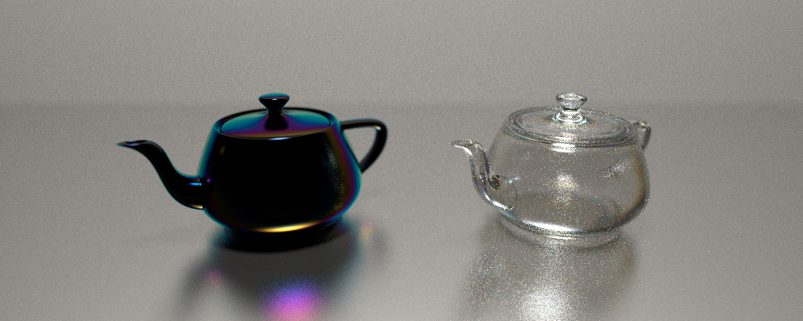

# λ (Lambda)
A C++ Hero-wavelength Spectral Path Tracer using my library numli

Sample rendering of two teapots on a glossy floor at 1024 samples per pixel illuminated by a D65 illuminant. Left: 550nm thick Acetate thin-film coating. Right: Solid teapot with Indium-Tin Oxide index of refraction.

## Highlight Features
* Hero-wavelength Spectral MIS path tracing
* Wide BVH with 8-way AVX2 box intersection
* Blinn, Lambertian, and thin-film materials
* Scene definition in `.nls` files

## Building
From the project root invoke `make [debug, release]` for debug or release 

## Usage
Navigate to `bin/`, call `./lambda <fpath> -s <SPP> -b <MAX_BOUNCES> -p <BOUNCE_PROB>` for rendering.

## Future Work
* Distributed rendering
* Anisotropic Microfacet material
* Absorption
* Volumetric scattering
* Lens-based Camera
* Textures
* loading `gltf` scenes linked in `.nls` files

## Dependencies
This project uses `C++23`, `OpenMP`, and `AVX2` instructions, and has been tested to compile with 
`g++15`.